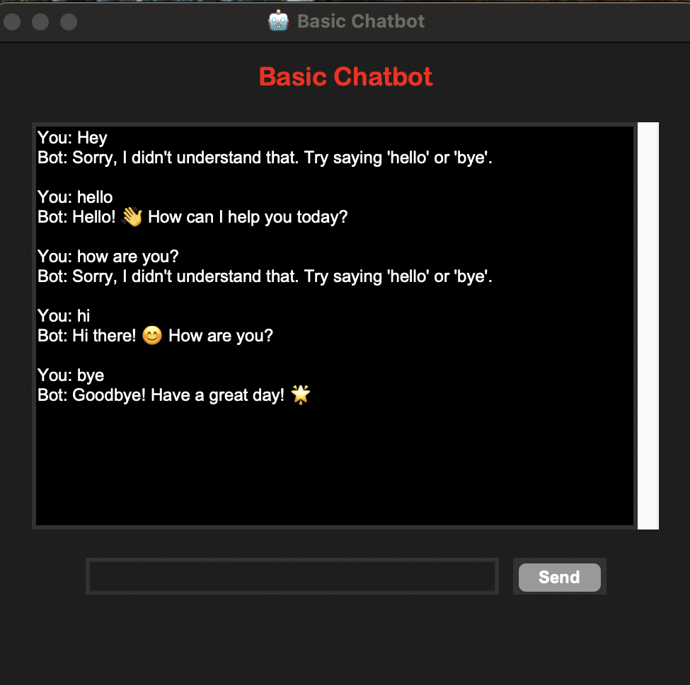

# 🤖 Basic Chatbot – CodeAlpha Task 03

This project was completed as part of my **Python Programming Internship** at **CodeAlpha** (Task 03).
The objective of this task was to build a **simple rule-based chatbot** with a **graphical user interface (GUI)** using Python’s Tkinter library.

---

## 📌 Task Objective

Develop a **rule-based chatbot** that:

* Responds to predefined user inputs such as "hello," "hi," "how are you," or "bye."
* Provides **appropriate replies** to make interactions feel natural.
* Features a **GUI interface** with a scrollable chat window for user interaction.
* Uses a **professional color scheme** for readability and user experience.

---

## 🛠️ Technologies Used

* **Python 3** – Core programming language
* **Tkinter** – For GUI design
* **ScrolledText widget** – For chat display
* **Dictionary** – For predefined responses

---

## 📁 Project Structure

```
basic_chatbot/
├── chatbot_gui.py       # Main GUI code for rule-based chatbot
├── README.md            # Project overview and instructions
```

---

## 🖼️ Features & Screenshots

### 🔹 Chat Interface

* Scrollable chat area displays the conversation.
* User inputs a message and clicks **Send** to interact with the bot.

### 🔹 Predefined Responses

* Responds to greetings: "hello", "hi".
* Conversational check: "how are you".
* Exit conversation: "bye".
* Default fallback message for unknown inputs.

### 🔹 GUI Theme

* **Black background with red/white text** for a professional look.
* User-friendly and interactive for beginners.

---

### 🖼️ GUI Screenshot



> **Tip:** Replace `screenshot_chatbot.png` with a screenshot from your running GUI.

---

## 🖥️ How to Run

1. Ensure **Python 3** is installed.

2. Run the program:

```bash
python chatbot_gui.py
```

3. Enter a message in the input box and click **Send**.
4. Observe the chatbot's reply in the scrollable chat area.

---

## 🔧 Future Enhancements

* Integrate **dynamic responses** using NLP libraries.
* Add **voice input/output** for interactive experience.
* Expand the bot’s knowledge with more **predefined questions and answers**.
* Implement **logging of conversations** for analysis.

---

## 🎓 Internship & Task Details

* **Internship Track**: Python Programming
* **Internship Provider**: CodeAlpha
* **Task Name**: Basic Chatbot (Task 03)
* **Environment**: Python + Tkinter

---

## 📬 Contact

* **Name**: Difina George
* 📧 **Email**: [difina.georgecs@gmail.com](mailto:difina.georgecs@gmail.com)
* 📍 **Location**: Kerala, India
